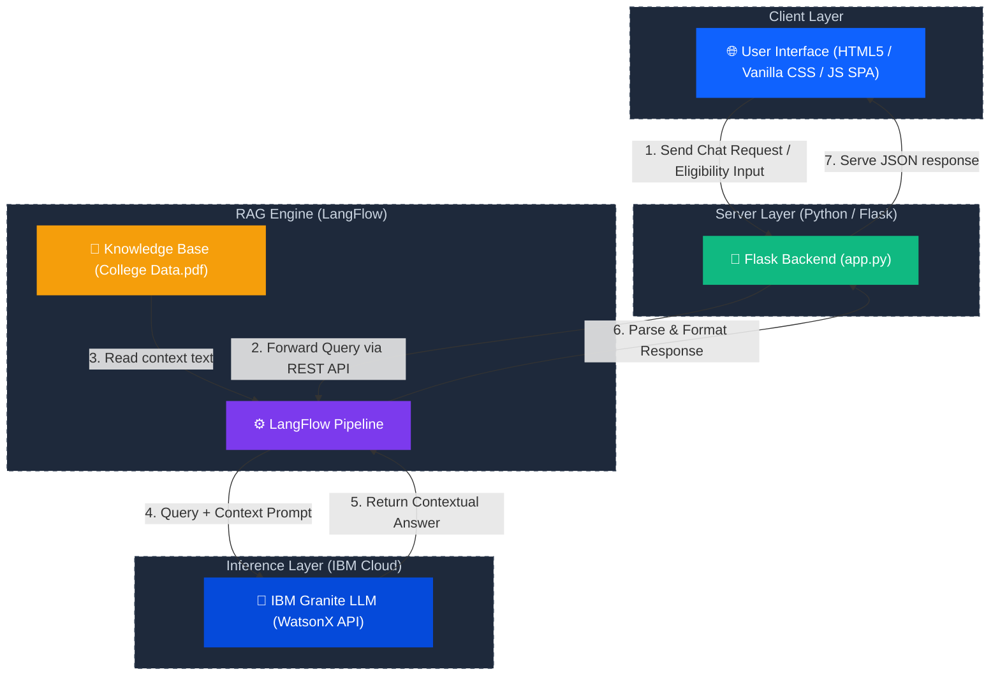
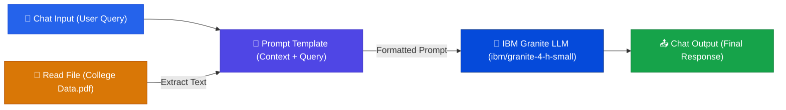
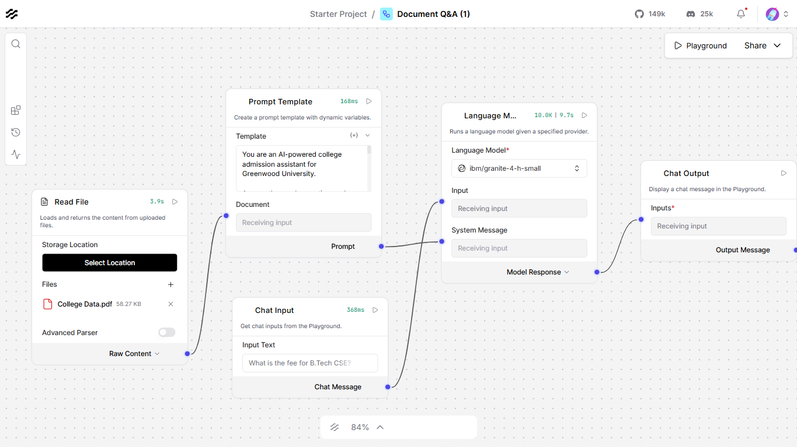

# 🎓 EduAdmit AI — College Admission Agent (RAG-Based)

<div align="center">


[](https://www.ibm.com/granite)
[](https://www.langflow.org/)
[](https://flask.palletsprojects.com/)
[](https://python.org)
[](https://cloud.ibm.com/)
[](LICENSE)

**An AI-powered College Admission Assistant built using RAG (Retrieval-Augmented Generation), IBM Granite LLM, and LangFlow — providing instant, accurate answers to student queries about admissions, fees, courses, and deadlines.**

[🚀 Live Demo](#-getting-started) · [📸 Screenshots](#-screenshots) · [🏗️ Architecture](#️-system-architecture) · [📖 Features](#-features)

</div>

---

## 📽️ Project Demo Video

> 🎬 **[Click here to watch the demo video](./demo/project_demo.mp4)**
>
> Watch the full walkthrough of EduAdmit AI — from asking questions in the chat to checking eligibility and exploring fee structures.

---

## 📌 Problem Statement

**Problem Statement #4 — College Admission Agent (RAG Based)**

> *A College Admission Agent, powered by RAG (Retrieval-Augmented Generation), streamlines the student admission process. It retrieves and summarizes admission policies, eligibility criteria, and FAQs from institutional databases and official sources. Prospective students can ask natural language questions and receive accurate, up-to-date responses instantly.*

**Key Goals:**
- ✅ Reduce manual admission inquiries
- ✅ Provide 24/7 instant AI-powered answers
- ✅ Enhance transparency and accessibility in college admissions
- ✅ Leverage **IBM Granite** (mandatory) via IBM Cloud Lite services

---

## ✨ Features

| Feature | Description |
|---|---|
| 💬 **AI Chat Interface** | Natural language Q&A powered by IBM Granite via LangFlow RAG |
| ⚡ **Quick FAQ Sidebar** | 10 one-click pre-loaded questions |
| 📅 **Deadlines Tracker** | Visual admission deadline cards with Open/Closing/Closed status |
| 💰 **Fee Structure** | Complete fee table for 10+ programs with scholarship info |
| ✅ **Eligibility Checker** | Interactive form with instant eligibility result |
| 📱 **Responsive Design** | Mobile-friendly with collapsible sidebar |
| 🎨 **Premium Dark UI** | IBM Blue + Deep Navy theme with smooth animations |
| 🔄 **Session Memory** | Maintains conversation context within a session |

---

## 🏗️ System Architecture

The project is built using a modern, decoupled architecture consisting of a **Flask frontend-backend wrapper**, a **LangFlow orchestration engine**, and the **IBM Granite Large Language Model** running on IBM Cloud Lite.

### High-Level Architecture

The diagrams below describe the request-response lifecycle and how the retrieval-augmented generation (RAG) system feeds domain-specific college admission details to the LLM:



### LangFlow RAG Pipeline

The visual RAG workflow configured within LangFlow coordinates data extraction, prompt shaping, and model inference:



### LangFlow Visual Editor Screenshot

Below is the visual pipeline configuration as built inside the LangFlow Editor:



*Data Flow: Read File (College Data.pdf) ➔ Prompt Template ➔ IBM Granite LLM ➔ Chat Output*

---

## 🛠️ Tech Stack

| Layer | Technology | Purpose |
|---|---|---|
| **LLM** | IBM Granite (`ibm/granite-4-h-small`) | Core language model for RAG responses |
| **Cloud** | IBM Cloud Lite | Hosting & API access for IBM Granite |
| **RAG Pipeline** | LangFlow | Visual RAG pipeline builder |
| **Knowledge Base** | PDF Document (College Data.pdf) | Source of admission information |
| **Backend** | Python + Flask 3.0 | REST API server |
| **Frontend** | HTML5 + Vanilla CSS + JavaScript | Premium web UI |
| **HTTP Client** | Python `requests` | LangFlow API communication |

---

## 📁 Project Structure

```
college-admission-agent/
│
├── 📄 app.py                    # Flask backend — routes & LangFlow API calls
├── 📋 requirements.txt          # Python dependencies
├── 📖 README.md                 # This file
├── 📜 LICENSE                   # MIT License
├── 🔒 .gitignore                # Git ignore rules
│
├── 📂 templates/
│   └── index.html               # Main HTML page (SPA)
│
├── 📂 static/
│   ├── style.css                # Premium dark theme CSS
│   └── script.js                # Chat, tabs, eligibility JS
│
├── 📂 assets/
│   ├── langflow_pipeline.png              # LangFlow architecture screenshot
│   ├── Screenshot 2026-06-06 004439.png   # Chat interface screenshot
│   ├── Screenshot 2026-06-06 004407.png   # Admission Deadlines screenshot
│   ├── Screenshot 2026-06-06 004339.png   # Fee Structure screenshot
│   └── Screenshot 2026-06-06 004256.png   # Eligibility Checker screenshot
│
├── 📂 demo/
│   └── project_demo.mp4                   # 📽️ Full app walkthrough video
│
└── 📂 langflow/
    └── college_admission_flow.json        # Importable LangFlow pipeline file
```

---

## 🚀 Getting Started

### Prerequisites

- Python 3.10 or higher
- [LangFlow](https://www.langflow.org/) installed and running locally
- IBM Cloud account (Lite tier) with IBM Granite API access

### 1. Clone the Repository

```bash
git clone https://github.com/dhanish0711/college-admission-agent.git
cd college-admission-agent
```

### 2. Install Dependencies

```bash
pip install -r requirements.txt
```

### 3. Set Up LangFlow

```bash
# Install LangFlow
pip install langflow

# Run LangFlow server
langflow run
# → Opens at http://localhost:7860
```

Import the flow:
1. Open LangFlow at `http://localhost:7860`
2. Click **Import** → select `langflow/college_admission_flow.json`
3. Upload your `College Data.pdf` to the **Read File** component
4. Add your IBM Granite API key to the **Language Model** component
5. Click **Save** and note your **Flow ID**

### 4. Configure API Keys

Open `app.py` and update:

```python
LANGFLOW_API_KEY = "your-langflow-api-key-here"
LANGFLOW_URL     = "http://localhost:7860/api/v1/run/YOUR-FLOW-ID"
```

### 5. Run the Application

```bash
python app.py
```

Open your browser at **[http://localhost:5000](http://localhost:5000)** 🎉

---

## 📸 Screenshots

### 💬 Chat with AI
> IBM Granite LLM answering student queries in real-time via the LangFlow RAG pipeline.


---

### 📅 Admission Deadlines
> Visual deadline tracker with color-coded status badges — Open, Closing Soon, and Closed.


---

### 💰 Fee Structure
> Complete program-wise fee table for 2025–26 with scholarship highlights.


---

### ✅ Eligibility Checker
> Interactive academic profile form with instant eligibility result for any program.


---

## 🔌 API Reference

### POST `/chat`

Send a message to the admission agent.

**Request:**
```json
{
  "message": "What is the fee for B.Tech CSE?"
}
```

**Response:**
```json
{
  "response": "The annual fee for B.Tech Computer Science & Engineering is ₹1,45,000 which includes tuition fee of ₹1,20,000 and other charges of ₹25,000..."
}
```

### POST `/check-eligibility`

Check program eligibility based on academic profile.

**Request:**
```json
{
  "program": "B.Tech",
  "qualification": "10+2 (PCM)",
  "percentage": 75,
  "entrance": ["JEE Main"]
}
```

**Response:**
```json
{
  "status": "eligible",
  "icon": "✅",
  "title": "Eligible for B.Tech!",
  "points": ["✔ 10+2 with PCM background", "✔ 75% meets the 60% minimum", "✔ Valid entrance exam qualified"],
  "message": "Congratulations! You meet all requirements. Apply now!"
}
```

---

## 🎯 Use Cases

- **Prospective Students** — Get instant answers without waiting for office hours
- **Parents** — Explore fee structures and scholarship options
- **College Administrators** — Reduce repetitive inquiry workload by 80%+
- **Counsellors** — Quick reference tool during counselling sessions

---

## 🤝 Contributing

Contributions are welcome! Please feel free to submit a Pull Request.

1. Fork the repository
2. Create your feature branch (`git checkout -b feature/AmazingFeature`)
3. Commit your changes (`git commit -m 'Add some AmazingFeature'`)
4. Push to the branch (`git push origin feature/AmazingFeature`)
5. Open a Pull Request

---

## 📜 License

This project is licensed under the MIT License — see the [LICENSE](LICENSE) file for details.

---

## 👨‍💻 Author

<div align="center">

### **Dhanish Ladwani**

[](https://github.com/dhanish0711/)

*Built as part of the Edunet Foundation AI/ML Internship Program*

**Problem Statement #4 — College Admission Agent (RAG Based)**

</div>

---

## 🙏 Acknowledgements

- **[IBM](https://www.ibm.com/)** — For IBM Granite LLM and IBM Cloud Lite services
- **[LangFlow](https://www.langflow.org/)** — For the visual RAG pipeline builder
- **[Edunet Foundation](https://www.edunetfoundation.org/)** — For the internship opportunity
- **[Flask](https://flask.palletsprojects.com/)** — For the lightweight Python web framework

---

<div align="center">

Made with ❤️ by [Dhanish Ladwani](https://github.com/dhanish0711/) | Powered by IBM Granite 🤖

</div>
